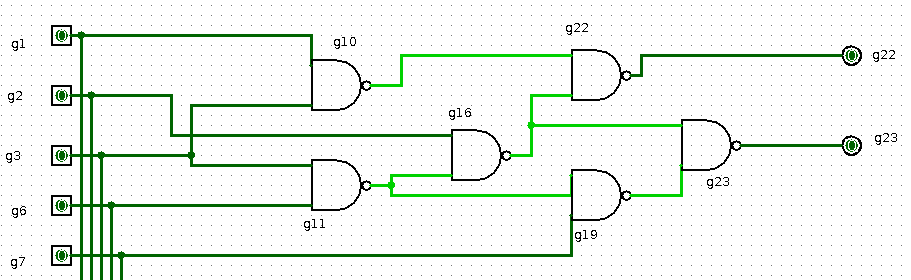
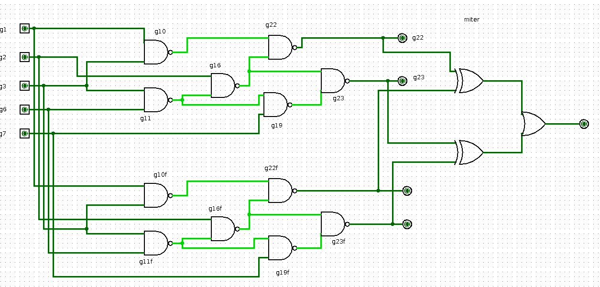
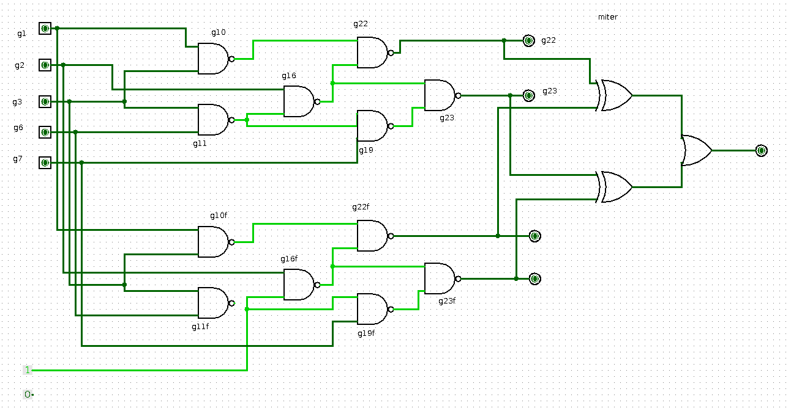

# Automatic-Test-Pattern-Generation
This program was implemented as part of the course Hardware Design at Johannes Kepler University.

# Background
Integrated circuits need to be checked for production faults. There are several fault models that describe which faults can occur and what their consequences are. On such fault model is the Stuck-at fault. In this case a connection between gates does not transfer the electrical signal correctly and instead produces a constant LOW (0) or HIGH (1) signal. (For more details see for example: https://en.wikipedia.org/wiki/Stuck-at_fault). Since we cannot check all connections in a physical integrated circuit and can only simulate an input and observe the output of the circuit, we need a method that generates an input that allows us to ascertain whether the circuit has a Stuck-at fault by only observing the outputs. This program implements a SMT-solver based algorithm to generate inputs that allows us to detect Stuck-at faults.

# Implementation
The input files that describe the circuit need to have the Bench format (for examples see: https://ddd.fit.cvut.cz/prj/Benchmarks/).

The input file is parsed and an internal data structure is built up. This data structure has Gates, Nodes and Edges that represent the circuit. Nodes are use to represent the input and output of the circuit, but are also used inside the Gates to represent input and output connection points. The Edges connect on node to another node.

Next a copy of the circuit is made and is connected to the original circuit by connecting the corresponding input nodes and appending a miter structure to the outputs (for an explanation of the mitre structure see below). 

Then the user can choose the location of the fault and whether it is a Stuck-at-0 or Stuck-at-1 fault. The circuit with the miter structure is changed accordingly. The image below shows an example where the output of the Nand Gate  g11 is stuck at 1.

The miter structure connects the corresponding output signals of two circuits with XOR gates and feeds all output signals of these XOR gates into an OR gate. The output of the OR gate can only be 1 if any output of the XOR gates is one. A XOR gate outputs a 1 only if the input bits are different. This means that the miter structure outputs a 1 only if the outputs of the two circuits are different.

This circuit is then encoded as an SMT instance and passed to the SMT solver Z3. The encoding works as follows:
For each input and output of each gate and for each input and output node, a boolean variable is introduced. For each edge the connected nodes have to have the same value. For each gate the output value has to have the value corresponding to its function and input values. For example,a NAND gate with the Inputs 'I1' and 'I2' and Output 'O' has the constraint 'O' == nand(I1, I2). Finally, the output of the miter structure needs to be 1. This ensures that the faulty and fault free circuits have different outputs and the fault can be observed by only looking at the output values.

If the SMT solver finds a model, i.e. a solution to the instance is found, the generated input pattern, that allows us to check for the given fault, can be extracted. Otherwise the given fault cannot be detected.
